# Praktikum 11: PHP OOP Lanjutan - Framework Modular

**Nama:** Afdhal Agislam

**NIM:** 312410445  

**Kelas:** TI 24 A5

## Tujuan Praktikum
1. Memahami konsep dasar Framework Modular
2. Memahami konsep dasar routing
3. Membuat Framework sederhana menggunakan PHP OOP

## Struktur Folder Project

```
lab11_php_oop/
├── .htaccess
├── config.php
├── index.php
├── class/
│   ├── Database.php
│   └── Form.php
├── module/
│   ├── home/
│   │   └── index.php
│   └── artikel/
│       ├── index.php
│       ├── tambah.php
│       ├── ubah.php
│       └── hapus.php
└── template/
    ├── header.php
    └── footer.php
```

## Langkah-langkah Praktikum

### 1. Persiapan Database

Buat database dan tabel menggunakan query SQL berikut:

```sql
CREATE DATABASE IF NOT EXISTS latihan_oop;
USE latihan_oop;

CREATE TABLE IF NOT EXISTS artikel (
    id INT(11) AUTO_INCREMENT PRIMARY KEY,
    judul VARCHAR(255) NOT NULL,
    isi TEXT NOT NULL,
    tanggal DATE NOT NULL
);
```

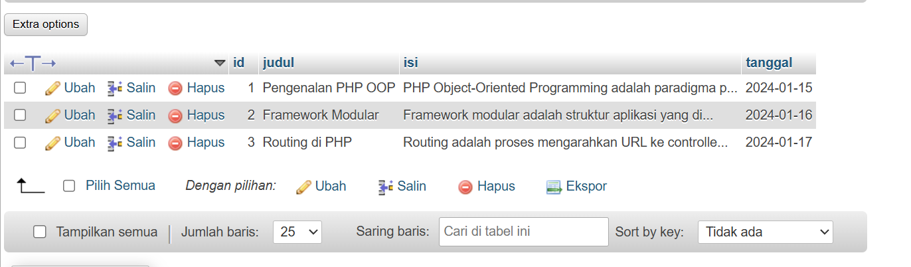

### 2. Konfigurasi Database (config.php)

File ini berisi konfigurasi koneksi database.

```php
<?php
$config = [
    'host' => 'localhost',
    'username' => 'root',
    'password' => '',
    'db_name' => 'latihan_oop'
];
?>
```

### 3. Class Database (class/Database.php)

Class ini menangani operasi database (CRUD - Create, Read, Update, Delete).

**Fitur:**
- `query()` - Menjalankan query SQL
- `get()` - Mengambil satu data
- `insert()` - Menambah data
- `update()` - Mengubah data
- `delete()` - Menghapus data


### 4. Class Form (class/Form.php)

Class ini untuk membuat form input dinamis dengan berbagai tipe input.

**Tipe Input yang Didukung:**
- Text
- Password
- Textarea
- Select/Dropdown
- Radio Button
- Checkbox

### 5. File .htaccess

File ini mengatur URL rewriting agar routing dapat berfungsi.

```apache
<IfModule mod_rewrite.c>
    RewriteEngine On
    RewriteBase /lab11_php_oop/
    RewriteCond %{REQUEST_FILENAME} !-d
    RewriteCond %{REQUEST_FILENAME} !-f
    RewriteRule ^(.*)$ index.php/$1 [L]
</IfModule>
```


### 6. Routing System (index.php)

File ini adalah gerbang utama yang menangani routing ke modul-modul.

**Cara Kerja Routing:**
- URL: `http://localhost/lab11_php_oop/artikel/index`
- Module: `artikel`
- Page: `index`
- File: `module/artikel/index.php`


### 7. Template System

#### template/header.php
Berisi header HTML, CSS, dan navigasi.


#### template/footer.php
Berisi penutup HTML dan footer.


### 8. Module Home

#### module/home/index.php
Halaman utama/beranda aplikasi.


### 9. Module Artikel

#### module/artikel/index.php
Menampilkan daftar artikel dari database.

**Fitur:**
- Menampilkan semua artikel dalam tabel
- Tombol tambah artikel
- Tombol edit dan hapus per artikel


#### module/artikel/tambah.php
Form untuk menambah artikel baru.


#### module/artikel/ubah.php
Form untuk mengubah artikel yang sudah ada.


#### module/artikel/hapus.php
Proses menghapus artikel.


## Konsep yang Dipelajari

### 1. Framework Modular
Framework modular adalah arsitektur aplikasi di mana setiap fitur dipisahkan ke dalam modul-modul independen. Keuntungannya:
- Kode lebih terorganisir
- Mudah dikembangkan (scalable)
- Mudah dipelihara (maintainable)
- Dapat digunakan kembali (reusable)

### 2. Routing
Routing adalah mekanisme untuk mengarahkan URL ke controller/file yang sesuai.

**Contoh:**
```
URL: /lab11_php_oop/artikel/tambah
├── Module: artikel
└── Page: tambah
    └── File: module/artikel/tambah.php
```

### 3. URL Rewriting
Menggunakan `.htaccess` untuk membuat URL yang lebih bersih dan SEO-friendly.

**Sebelum:** `index.php?mod=artikel&page=tambah`  
**Sesudah:** `/artikel/tambah`

### 4. Template System
Memisahkan bagian layout (header, footer) dari konten untuk menghindari duplikasi kode.

## Cara Menjalankan Project

1. Pastikan XAMPP sudah terinstall dan Apache + MySQL aktif
2. Copy folder `lab11_php_oop` ke `C:\xampp\htdocs\`
3. Import database menggunakan file `database.sql`
4. Sesuaikan konfigurasi di `config.php`
5. Buka browser dan akses: `http://localhost/lab11_php_oop/`

## Testing

### Test Routing
- ✓ Home: `http://localhost/lab11_php_oop/home/index`
- ✓ Artikel: `http://localhost/lab11_php_oop/artikel/index`
- ✓ Tambah: `http://localhost/lab11_php_oop/artikel/tambah`

### Test CRUD Operations
- ✓ Create: Tambah artikel baru
- ✓ Read: Tampilkan daftar artikel
- ✓ Update: Edit artikel
- ✓ Delete: Hapus artikel

## Kesimpulan

Dari praktikum ini, saya telah mempelajari:
1. Cara membuat framework modular sederhana menggunakan PHP OOP
2. Implementasi routing untuk membuat URL yang lebih bersih
3. Penggunaan class Database untuk operasi CRUD
4. Penggunaan class Form untuk membuat form dinamis
5. Pemisahan tampilan menggunakan template system

Framework ini dapat dikembangkan lebih lanjut dengan menambahkan:
- Authentication system
- Validation
- Middleware
- Error handling yang lebih baik
- Dan fitur-fitur lainnya

## Referensi
- Modul Praktikum Pemrograman Web - Universitas Pelita Bangsa
- PHP Manual: https://www.php.net/manual/en/
- PHP OOP Tutorial

---

# Praktikum 11 & 12: PHP OOP Framework dengan Autentikasi


##  Modul Artikel (CRUD)

### 1. Daftar Artikel (module/artikel/index.php)

Menampilkan semua artikel dalam bentuk tabel dengan tombol Edit dan Hapus.

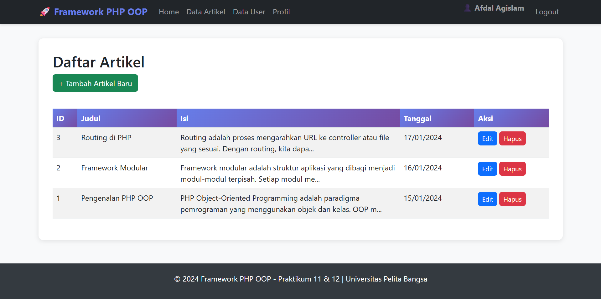

---

### 2. Tambah Artikel (module/artikel/tambah.php)

Form untuk menambah artikel baru menggunakan Bootstrap.

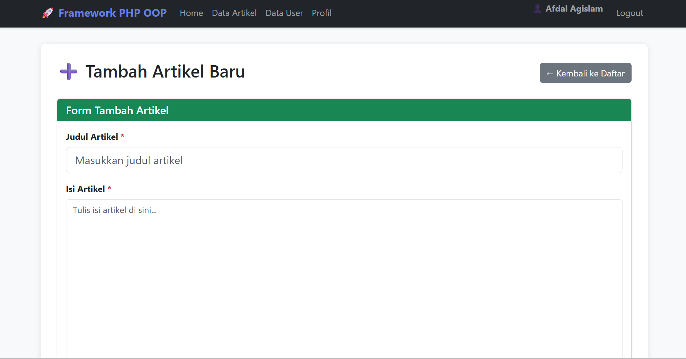


---

### 3. Edit Artikel (module/artikel/ubah.php)

Form untuk mengubah artikel yang sudah ada dengan data ter-filled.

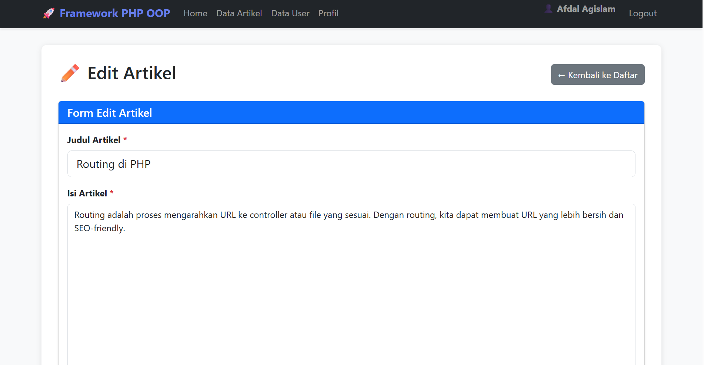

---

### 4. Hapus Artikel (module/artikel/hapus.php)

Proses menghapus artikel dengan konfirmasi JavaScript.

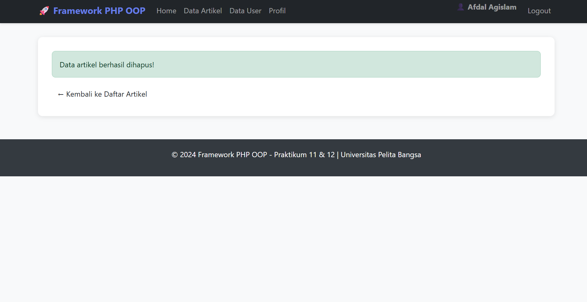

---

##  Modul User (CRUD dengan Form Dinamis)

### 1. Daftar User (module/user/index.php)

Menampilkan semua user dengan field lengkap.

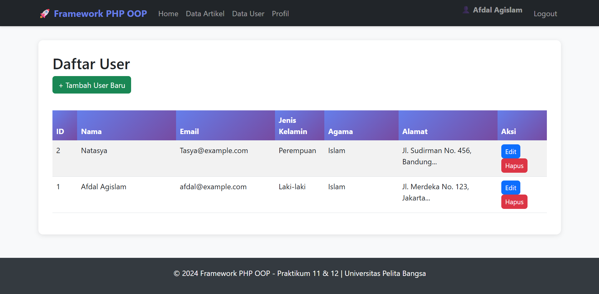


---

### 2. Tambah User (module/user/tambah.php)

Form lengkap menggunakan Class Form dengan berbagai tipe input:
- Text (Nama, Email)
- Password
- Radio Button (Jenis Kelamin)
- Select/Dropdown (Agama)
- Checkbox (Hobi - multi pilihan)
- Textarea (Alamat)

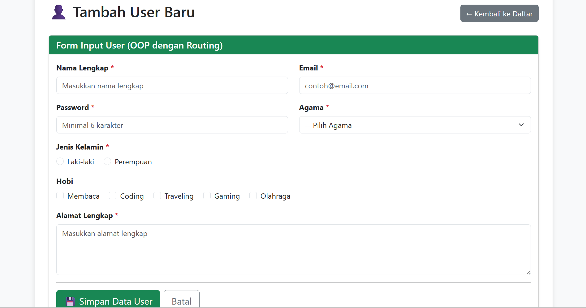

---

### 3. Edit User (module/user/ubah.php)

Form edit user dengan data yang sudah ter-filled.


---

### 4. Hapus User (module/user/hapus.php)

Proses hapus data user.

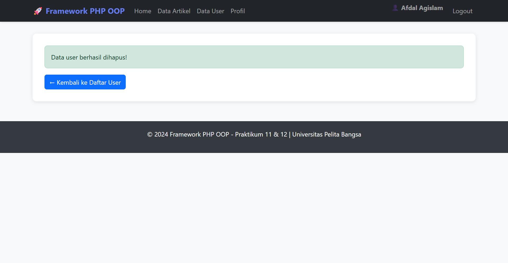


---

##  Halaman Home

Halaman utama yang menampilkan informasi framework.

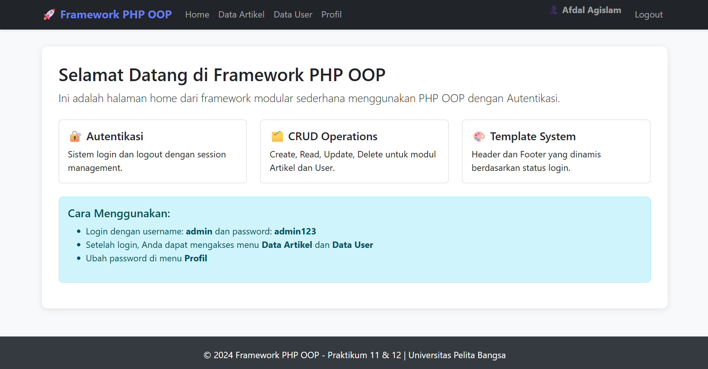

---

# Praktikum 12: Autentikasi dan Session

##  Tujuan Praktikum 12
1. Memahami konsep dasar Autentikasi
2. Memahami konsep dasar Session
3. Mengimplementasikan Autentikasi sederhana dengan enkripsi password

---

##  Persiapan Database untuk Autentikasi

### 1. Membuat Tabel users_auth

```sql
CREATE TABLE IF NOT EXISTS users_auth (
    id INT AUTO_INCREMENT PRIMARY KEY,
    username VARCHAR(50) NOT NULL,
    password VARCHAR(255) NOT NULL,
    nama VARCHAR(100)
);
```

### 2. Insert Data Admin

```sql
-- Password: admin123
INSERT INTO users_auth (username, password, nama)
VALUES ('admin', '$2y$10$92IXUNpkjO0rOQ5byMi.Ye4oKoEa3Ro9llC/.og/at2.uheWG/igi', 'Afdal Agislam');
```

**Screenshot:** *[Tampilkan screenshot tabel users_auth di phpMyAdmin]*

---

##  Update Routing dengan Session Check

### File index.php (Dengan Session)

Menambahkan pengecekan session sebelum mengakses halaman tertentu.

**Fitur:**
- `session_start()` di awal file
- Cek session login sebelum akses modul
- Halaman public: `home`, `user` (untuk login)
- Halaman protected: `artikel`, `user` (selain login)
- Redirect otomatis ke login jika belum login

---

##  Modul Login & Logout

### 1. Halaman Login (module/user/login.php)

**Fitur:**
- Form login dengan username dan password
- Verifikasi password menggunakan `password_verify()`
- Set session jika login berhasil
- Redirect ke halaman artikel setelah login
- Tampilan dengan gradient background

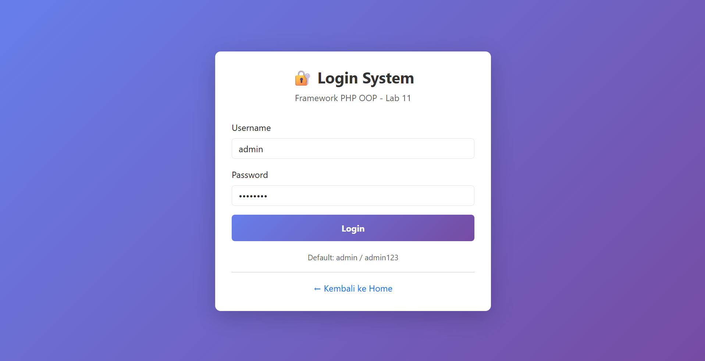

---

### 2. Proses Login Berhasil

**Alur Login:**
1. User input username: `admin` dan password: `admin123`
2. System query data dari database
3. Verifikasi password dengan `password_verify()`
4. Jika cocok, set session:
   - `$_SESSION['is_login'] = true`
   - `$_SESSION['username'] = 'admin'`
   - `$_SESSION['nama'] = 'Afdal Agislam'`
5. Redirect ke halaman artikel


---

### 3. Login Gagal

Jika username atau password salah, muncul alert error.

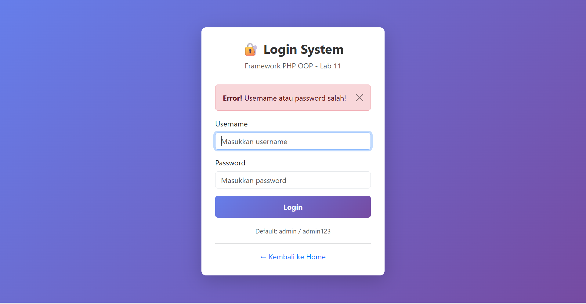


---

### 4. Logout (module/user/logout.php)

**Proses Logout:**
1. `session_start()`
2. `session_destroy()`
3. Redirect ke halaman login


---

##  Testing Proteksi Halaman

### 1. Akses Artikel Tanpa Login

Ketika mencoba akses `http://localhost/lab11_php_oop/index.php?mod=artikel&page=index` tanpa login, otomatis redirect ke login.

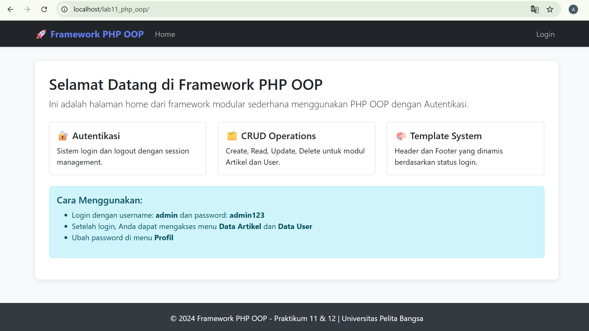

---

### 2. Akses Setelah Login

Setelah login, bisa mengakses semua menu.


---

##  Halaman Profil (Tugas Praktikum)

### Fitur Halaman Profil:

#### 1. Informasi Akun
Menampilkan data user yang sedang login:
- Nama: Afdal Agislam
- Username: admin
- Status: Aktif

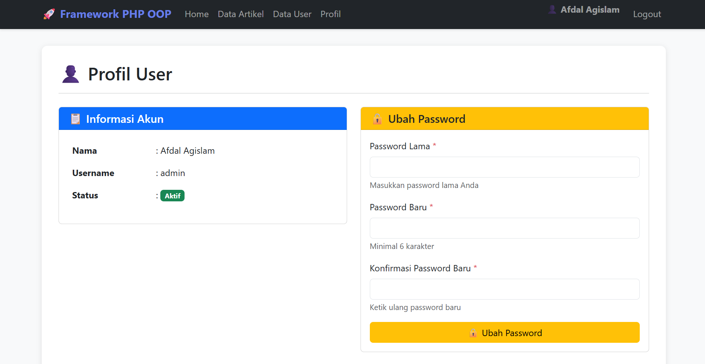

---

#### 2. Form Ubah Password

**Fitur Form:**
- Input Password Lama (required)
- Input Password Baru (minimal 6 karakter)
- Input Konfirmasi Password Baru
- Button "Ubah Password"

**Validasi:**
1.  Password lama harus benar
2.  Password baru minimal 6 karakter
3.  Password baru dan konfirmasi harus sama
4.  Password di-enkripsi dengan `password_hash()`

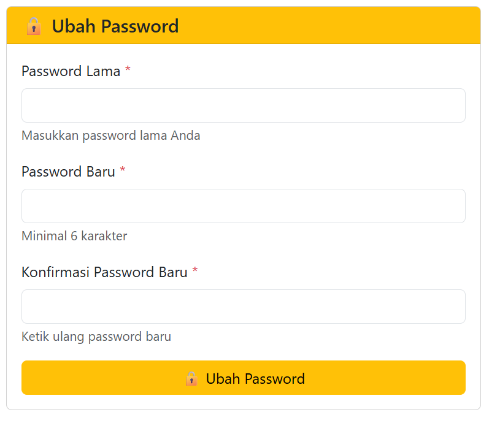

---

#### 3. Proses Ubah Password Berhasil

**Alur Ubah Password:**
1. User input password lama: `admin123`
2. User input password baru: `newpass123`
3. User input konfirmasi: `newpass123`
4. System verifikasi password lama dengan `password_verify()`
5. System hash password baru dengan `password_hash()`
6. Update ke database
7. Tampilkan alert sukses

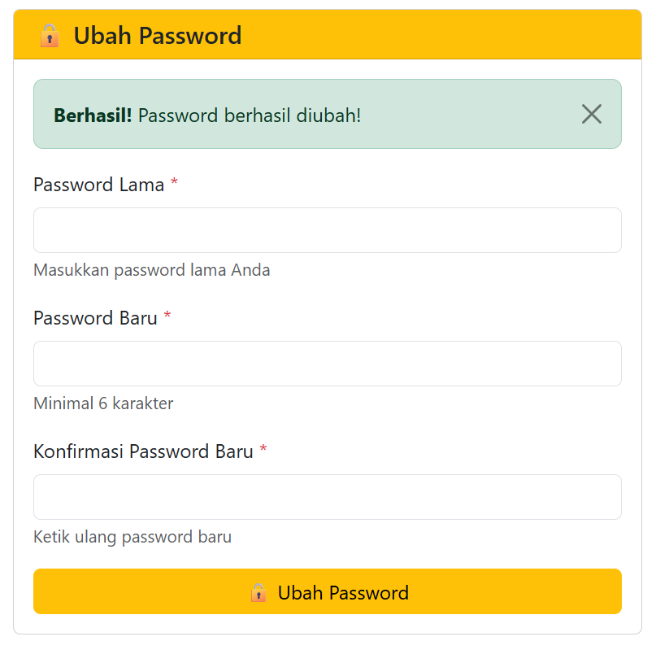

---

##  Fitur Lengkap yang Diimplementasikan

###  Praktikum 11:
-  Framework Modular dengan struktur folder terorganisir
-  Routing System dengan URL clean
-  Class Database untuk CRUD operations
-  Class Form untuk dynamic form generation
-  Template System (Header & Footer)
-  Modul Artikel (Create, Read, Update, Delete)
-  Modul User (Create, Read, Update, Delete)
-  Form dengan berbagai tipe input (text, password, textarea, select, radio, checkbox)

###  Praktikum 12:
-  Sistem Login dengan autentikasi
-  Session Management
-  Password Hashing dengan `password_hash()`
-  Password Verification dengan `password_verify()`
-  Proteksi halaman dengan session check
-  Menu navigasi dinamis berdasarkan status login
-  Halaman Profil user
-  Fitur Ubah Password dengan validasi lengkap
-  Logout functionality
-  Redirect otomatis ke login jika belum login

---

##  Konsep yang Dipelajari

### 1. Framework Modular
Framework modular adalah arsitektur aplikasi di mana setiap fitur dipisahkan ke dalam modul-modul independen.

**Keuntungan:**
- Kode lebih terorganisir
- Mudah dikembangkan (scalable)
- Mudah dipelihara (maintainable)
- Dapat digunakan kembali (reusable)

---

### 2. Routing
Routing adalah mekanisme untuk mengarahkan URL ke controller/file yang sesuai.

**Contoh:**
```
URL: /lab11_php_oop/artikel/tambah
├── Module: artikel
└── Page: tambah
    └── File: module/artikel/tambah.php
```

---

### 3. OOP (Object-Oriented Programming)
Menggunakan class dan object untuk membuat kode yang lebih terstruktur.

**Contoh:**
```php
$db = new Database();
$result = $db->query("SELECT * FROM artikel");
```

---

### 4. Autentikasi & Session
**Autentikasi:** Proses verifikasi identitas user (login)

**Session:** Menyimpan data user di server selama user aktif

**Password Hashing:**
```php
// Hash password saat register
$hash = password_hash($password, PASSWORD_DEFAULT);

// Verify password saat login
if (password_verify($input_password, $hash_from_db)) {
    // Login berhasil
}
```

---

### 5. CRUD Operations
- **Create:** Menambah data baru (`INSERT`)
- **Read:** Membaca/menampilkan data (`SELECT`)
- **Update:** Mengubah data yang ada (`UPDATE`)
- **Delete:** Menghapus data (`DELETE`)

---


**© 2025 Framework PHP OOP - Praktikum 11 & 12 | Universitas Pelita Bangsa**
